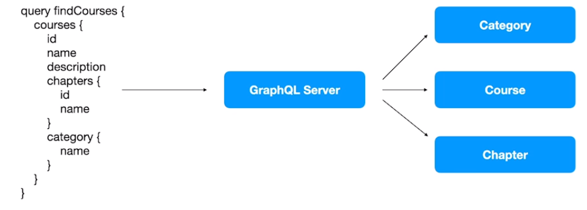
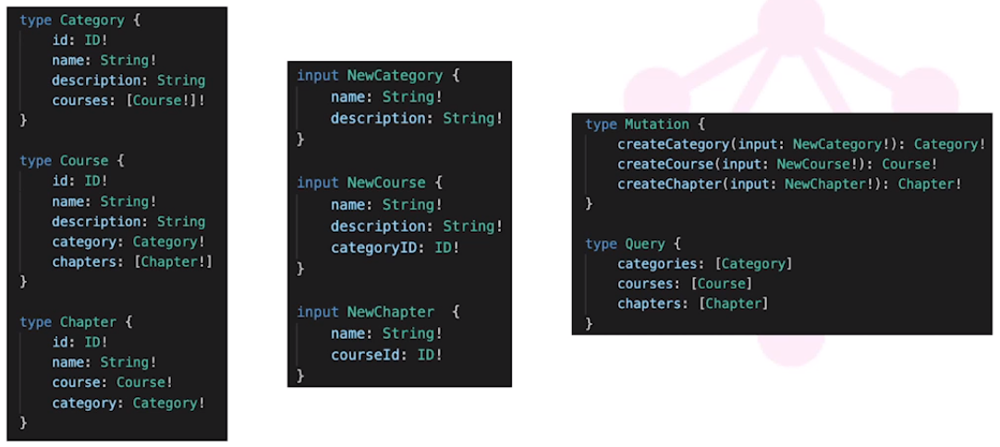
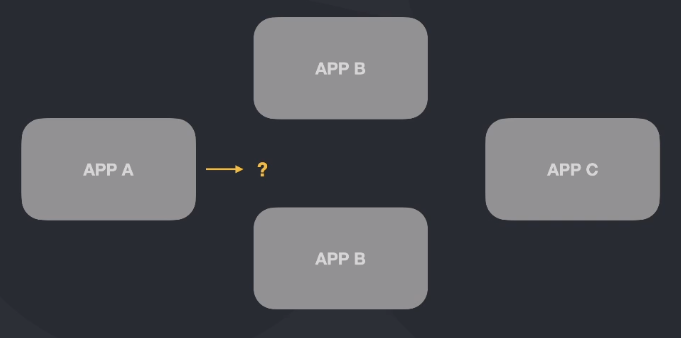
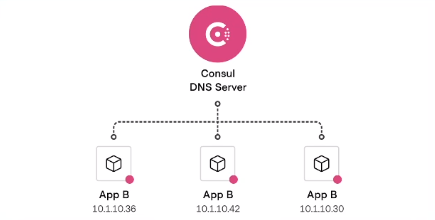
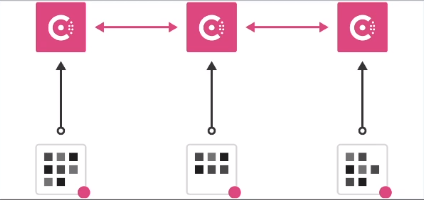
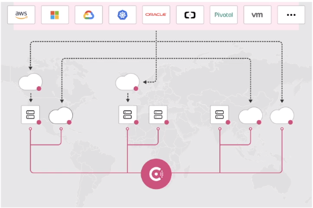

# Comunicação

- **Comunicação sincrona**: Acontece em tempo real. Alta dependencia entre sistemas.
- **Comunicação assincrona**: Não precisa ter a resposta na hora. Dependencia fraca entre sistemas.

## Comunicação Sincrona vs Assincrona

## REST
- Muitos desenvolvedores "já sabem trabalhar com REST"
- Representational state of transfer
- Surgiu em 2000 por Roy Fielding em uma dissertação de doutorado
- Simplicidade
- Stateless
- Cacheável

## REST: Níveis de maturidade (Richardson Maturity Model)

**Nivel 0:** The Swamp of POX

**Nível 1:** Utilização de resources

Verbo | URI | Operação
------|-----|---------
GET|/products/1|Buscar
POST|/products|Inserir
PUT|/products/1|Alterar
DELETE|/products/1|Remover

**Nível 2:** Utilização de Verbos HTTP mediante a sua representatividade

Verbo | Utilização
------|------------
GET|Recuperar informação
POST|Inserir
PUT|Alterar
DELETE|Remover

**Nível 3:** HATEOAS: Hypermedia as the Engine of Application State

``` json
HTTP/1.1 200 OK
Content-Type: application/vnd.acme.account+json
Content-Length: ...

{
    "account": {
        "account_number": 12345,
        "balance": {
            "currency": "usd",
            "value": 100.00
        },
        "links": {
            "deposit": "/account/12345/deposit",
            "withdraw": "/account/12345/withdraw",
            "transfer": "/account/12345/transfer",
            "close": "/account/12345/close"
        }
    }
}
```

## REST: Uma boa API REST

- Utiliza URIs únicas para serviços e itens que expostos para esses serviços
- Utiliza todos os verbos HTTP para realizar as operações em seus recursos, incluindo caching
- Provê links relacionais para os recursos exemplificando o que pode ser feito

## REST: HAL, Collection+JSON e Siren

- JSON não provê um padrão de hipermídia para realizar a linkagem
- HAL: Hypermedia Application Language
- Siren

## REST: HAL
Media Type = application/hal+json
```json
{
    "_links":{
        "self":{
            "href":"http://fullcycle.com.br/api/user/robson"
        }
    },
    "id":"robson",
    "name":"Robson Silva",
    "_embedded":{
        "family":{
            "_links":{
                "self":{
                    "href":"http://fullcycle.com.br/api/user/aline"
                }
            },
            "id":"aline",
            "name":"Aline França"
        }
    }
}
```

## REST: HTTP Method Negotiation
HTTP possui um outro método: OPTIONS. Esse método nos permite informar quais métodos são permitidos ou não em determinado recurso.

**OPTIONS /api/product HTTP/1.1**
**Host: fullcycle.com.br**

Resposta pode ser:
**HTTP/1.1 200 OK**
**Allow: GET, POST**

Caso envie a requisição em outro formato:
**HTTP/1.1 405 Not Allowed**
**Allow: GET, POST**

## REST: Content Negetiation
O Processo de content negotiation é baseado na requisição que o client está fazendo para server. Nesse caso ele solicita o que e como ele quer a resposta. O server então retornará ou não a informação no formato desejado.

**Accept Negotiation**
- Client solicita a informação e o tipo de retorno pelo server baseado no media type informado por ordem de prioridade.

**GET /product**
**Accept: application/json**

Resposta pode ser retorno dos dados ou:
**HTTP/1.1 406 Not Acceptable**

**Contenty-Type Negotiation**
Através de um content-type no header da request, o servidor consegue verificar se ele irá conseguir processar a informação para retornar a informação desejada.
``` json
POST /product HTTP/1.1
Accept: application/json
Content-Type: application/json

{
    "name":"Product 1"
}
```

Caso o servidor não aceite o content type, ele poderá retornar:
``` json
HTTP/1.1 415 Unsupported Mediaw Type
```

## gRPC
- É um framework desenvolvido pela google que tem o objetivo de facilitar o processo de comunicação entre sistemas de uma forma extremamente rápida, leve, independente de limguagem.
- Faz parte da CNCF (Cloud Native Computation Foundation)

##### Em quais casos podemos utilizar?
- Ideal para microsserviços
- Mobile, Browser e Backend
- Geração das bibliotecas de forma automática
- Streaming didirecional utilizando HTTP/2
  
##### Linguagens (Suporte oficial)
- GO
- JAVA
- C
    - C++
    - Python
    - Ruby
    - Objective C
    - PHP
    - C#
    - NodeJS
    - Dart
    - Kotlin/JVM

##### RPC - Remote Procedure Call


##### Protocol Buffers
"Protocol buffers are Google's language-neutral, extensible mechanism for serializing structured data - think XML, but smaller, faster, and simplier."

##### Protocol vs JSON
- Arquivos binários < JSON
- Processo de serialização é mais leve (CPU) do que JSON
- Gasta menos recursos de rede
- Processo é mais veloz

Protocol Buffers
``` bash
syntax = "proto3";

message SearchRequest {
    string query = 1;
    int32 page_number = 2;
    int32 result_per_page = 3;
}

```

### HTTP/2
- Nome original criado pelo Google era SPDY
- Lançado em 2015
- Dados trafegados são binários e não texto como no HTTP 1.1
- Utiliza a mesma conexão TCP para enviar e receber dados do cliente e do servidor (Multiplex)
- Server Push
- Headers são comprimidos
- Gasta menos recurso de rede
- Processo é mais veloz

### gRPC - API "unary"


### gRPC - API "Server streaming"


### gRPC - API "Client streaming"


### gRPC - API "Bi directional streaming"


### REST vc gRPC
JSON|gRPC
---|---
Texto/JSON | Protocol Buffers
Unidirecional | Bidirecional e Assíncrono
Alta latência | Baixa latência
Sem contrato (maior chance de erros) | Contrato definido (.proto)
Sem suporte a streaming (Request/Response) | Suporte a streaming
Design pré-definido | Design é livre
Bibliotecas de terceiros | Geração de código

[grpc.io](https://grpc.io/)
[developers.google.com/protocol-buffers](https://developers.google.com/protocol-buffers)

### Instalação das ferramentas gRPC
Olá pessoal!

Para usar as ferramentas que trabalharemos na aula seguinte para compilar os protofiles será necessário instalar alguns pacotes.

Hoje podemos unificar a instalação dos pacotes nos sistemas operacional, porque no Windows existe o WSL (Windows Subsystem for Linux). Se você ainda não configurou este ambiente no seu Windows, vá no módulo de Docker e veja o primeiro capítulo.

Execute estes comandos no seu terminal Linux/MAC:

``` bash
sudo apt install protobuf-compiler 
brew install protobuf #Mac, requer Homebrew instalado
```

``` bash
go get google.golang.org/protobuf/cmd/protoc-gen-go google.golang.org/grpc/cmd/protoc-gen-go-grpc
```

Para finalizar, temos que adicionar a pasta "/go/bin" no PATH do Linux para que tudo que seja instalado nesta pasta esteja disponível como comandos no terminal. Adicione no final do seu ~/.bash

``` bash
PATH="/go/bin:$PATH"
```

Execute o comando abaixo para atualizar seu terminal:
``` bash
source ~/.bashrc
```

Pronto, todos os executáveis usados na aula anterior já estão disponíveis no seu terminal.

É isso aí pessoal, até a próxima.

### Criando protofile e stubs
[./grpc/proto/user.proto](./grpc/proto/user.proto)
``` bash
protoc --proto_path=proto proto/*.proto --go_out=pb

protoc --proto_path=proto proto/*.proto --go_out=pb --go-grpc_out=pb
```

Rodando servidor GRPC
``` bash
go run cmd/server/server.go
```

Client GRPC
https://github.com/ktr0731/evans
``` bash
evans -r repl --host localhost --port 50051
```

## GraphQL

**Problema**: Client Desktop e Client Mobile não consomem a informação, fornecida pelo Sever, do mesmo jeito.

**Solução**: E se tivéssemos uma forma de que o client tivesse total autonomia para escolher quais dados ele gostaria de receber?

"GraphQL é uma linguagem de consulta para APIs e um tuntime para atender a essas consultas com seus dados existentes. GraphQL fornece uma descrição completa e compreensível dos dados em sua API, dá aos clientes o poder de pedir exatamente o que eles precisam e nada mais, torna mais fácil evoluir APIs ao longo do tempo e permite poderosas ferramentas para desenvolvedores." (https://graphql.org)

#### Grandes vantagens
- Único endpiint
- Única request
- Server apresenta os recursos disponíveis
- Client solicita somente a informação necessária
- Há possibilidade de realizar alterações / inserções nos dados através de "mutations"
- Trabalha utilizando HTTP
- Retorna json como response

#### Dinâmica


#### Schema
- GraphQL Schema Language
- Data Types
- Query
- Mutations
- Subscriptions

#### Exemplo


#### Funcionamento
- Queries realizam consultas e trazem os dados de acordo com a solicitação. Executadas em paralelo.
- Mutation realiza processo de create, update e delete. É executada em série. Ex:

Mutation
``` graphql
mutation createCategory {
    createCategory(input: {name:"PHP", description: "PHP is awsome"}) {
        id
        name
        description
    }
}
```

Query
``` graphql
query findCategories {
    categories {
        id
            name
            description
            courses {
                name
            }
    }
}
```

#### Criando Schema
https://github.com/99designs/gqlgen


## Service Discovery e Consul

#### Cenário comum em aplicações distribuídas

Cenário 1


Cenário 2


- Qual máquina chamar?
- Qual porta utilizar?
- Preciso saber o IP de cada instância?
- Como ter certeza se aquela instância está saudável?
- Como saber se tenho permissão para acessar

#### Service Discovery
- Descobre as máquinas disponíveis para acesso
- Segmentação de máquina para garantir segurança
- Resoluções via DNS
- Health check
- Como saber se tenho permissão para acessar

#### Hashcorp Consul
- Service Discovery
- Service Segmentation
- Load Balancer na Borda (Layer 7)
- Key/Value Configuration
- Opensource/Enterprise

#### Consul & Service Registry Centralizado


#### Health Check Ativo


#### Multi-região & Multi-cloud


#### Agent, Client e Server
- Agent: Processo que fica sendo executado em todos nós do cluster. Pode estar sendo executado em Client Mode ou Server Mode.
- Client: Registra os serviços localmente, Health check, encaminha as informações e configurações dos swerviços para o Server
- Server: Mantém o estado do cluster, registra os serviços, Membership (quem é client e quem é server), retorno de queries (DNS ou API), troca de informações entre datacenters, etc

#### Dev Mode
- Nunca utilize em produção
- Teste de featues, exemplos
- Roda como servidor
- Não escala
- Registra tudo em memória